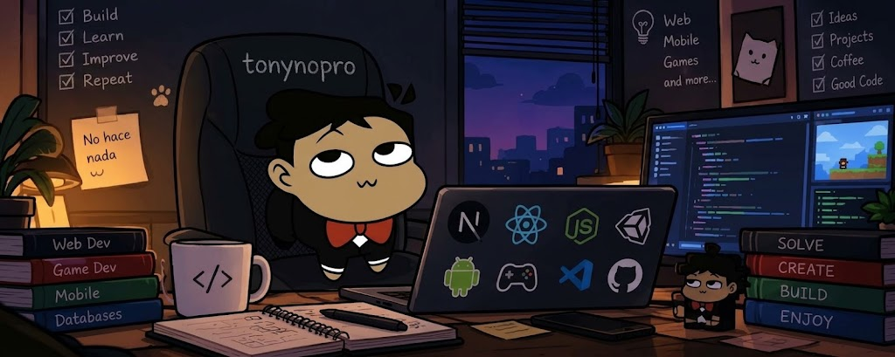

<!--
  BANNER: save your image as assets/banner.png in this same repository
  (recommended size: 1280x320 px) and it will show up here automatically.
  You can also swap the path for any image URL.
-->

  

<h1 align="center">Hi, I'm Tony</h1>

  <b>Full Stack Developer</b> · Web, Mobile & Games 
  <i>I build applications meant to be used, maintained, and scaled.</i>

  
  
  

  

---

## About me

- Full Stack Developer with experience in **web, mobile, and desktop** applications.
- Special interest in **game development with Unity**.
- I specialize in scalable solutions, from the frontend to the database.
- Languages: Spanish (native) · English (B1 intermediate).
- Reach me at: [tony.suarez1002@gmail.com](mailto:tony.suarez1002@gmail.com)

---

## Tech stack

**Web & Backend**

  

**Games & Desktop**

  

**Mobile**

  

**Databases**

  

---

## Projects

> More details on each one in my [portfolio](https://tonysuarez-dev.vercel.app/#proyectos).

| Project | Type | Description | Technologies | Year |
|---|---|---|---|---|
| **[Cinemar](https://tonysuarez-dev.vercel.app/proyectos/cinemar)** (featured) | Web | Cinema management system with multiple roles, a dynamic movie listing, and Stripe payments. | HTML/JS · Node.js · MySQL · Stripe API | 2024 |
| **[Fans de Omar](https://tonysuarez-dev.vercel.app/proyectos/fansdeomar)** (currently working) | Web | A living community app whose design automatically changes based on monthly events and birthdays. | Next.js · MySQL · Zoho Mail | 2025 |
| **[Schedule Comparator](https://tonysuarez-dev.vercel.app/proyectos/comparador-horarios)** | Web & Mobile | Cross-references datasets from multiple users to graphically map social connections and shared free time. | Next.js · SQLite · Data Viz | 2026 |
| **[Integrated Inventory System](https://tonysuarez-dev.vercel.app/proyectos/sistema-inventario)** | Web | Logistics traceability platform covering the full product lifecycle. | Next.js · MySQL | 2026 |
| **[Crezcamos Juntos](https://tonysuarez-dev.vercel.app/proyectos/crezcamos-juntos)** | Mobile | Android app for school management and environmental tracking of tree care. | Android · Kotlin | 2026 |
| **[Psychological Test System](https://tonysuarez-dev.vercel.app/proyectos/test-psicologicos)** | Web | Clinical platform to assess stress and anxiety; diagnostic logic lives in the database and charts progress over time. | React · Node.js · MySQL | 2025 |
| **[Uni Lab](https://tonysuarez-dev.vercel.app/proyectos/uni-lab)** | Web | Unity prototype that evolved into a web solution for laboratory management and resource control. | Unity · Web · UI/UX | 2024 |
| **[Pinol The Game](https://tonysuarez-dev.vercel.app/proyectos/pinol-the-game)** | Game | Personal 2D physics lab in Unity, growing into a modular metroidvania-style experience (v4.0). | Unity · C# | In development |
| **[Gemuku](https://tonysuarez-dev.vercel.app/proyectos/gemuku)** | Game / Desktop | Offline educational platform built in Unity that generates and reads CSV files without needing internet. | Unity · C# · CSV | 2021 |

---

## Awards

- **Infomatrix 2024**: Silver medal at the regional stage, qualifying for the national phase.
- **National Prototype and Entrepreneurship Projects Contest 2022**: First place at the local stage, second place at the regional stage, and advancement to the national stage.

---

## GitHub stats

  
  

  

---

<h3 align="center">Have an idea? Let's build something real.</h3>

  <a href="mailto:tony.suarez1002@gmail.com">Contact me</a> ·
  <a href="https://tonysuarez-dev.vercel.app/">Portfolio</a> ·
  <a href="https://linkedin.com/in/ricardoantoniosuarez">LinkedIn</a>

